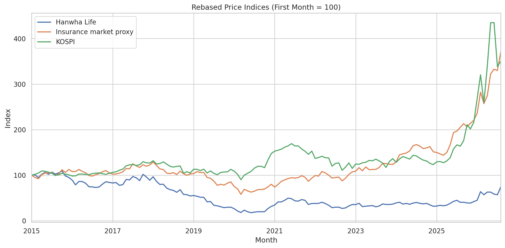
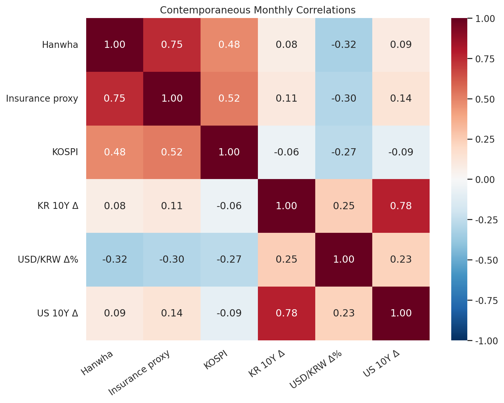
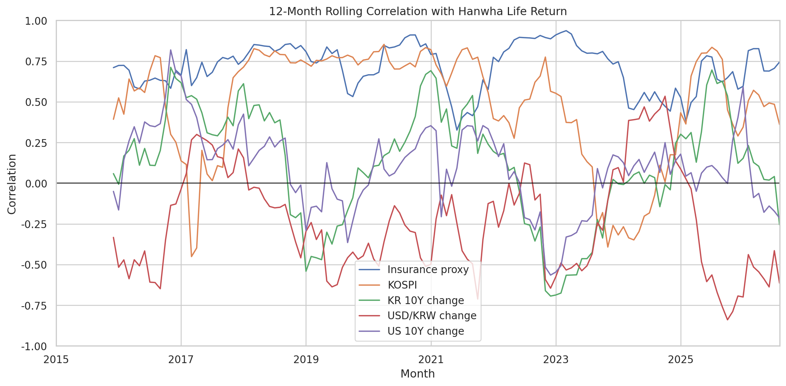
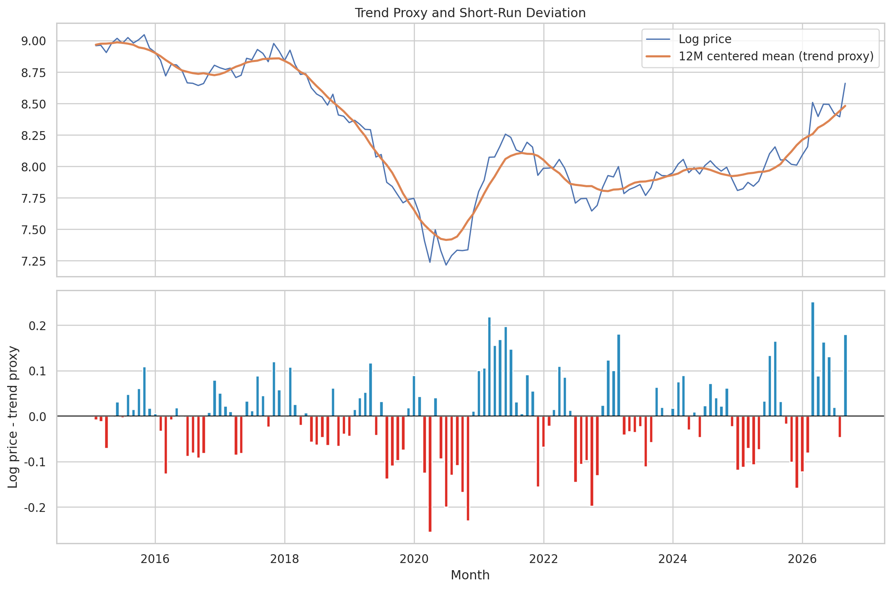
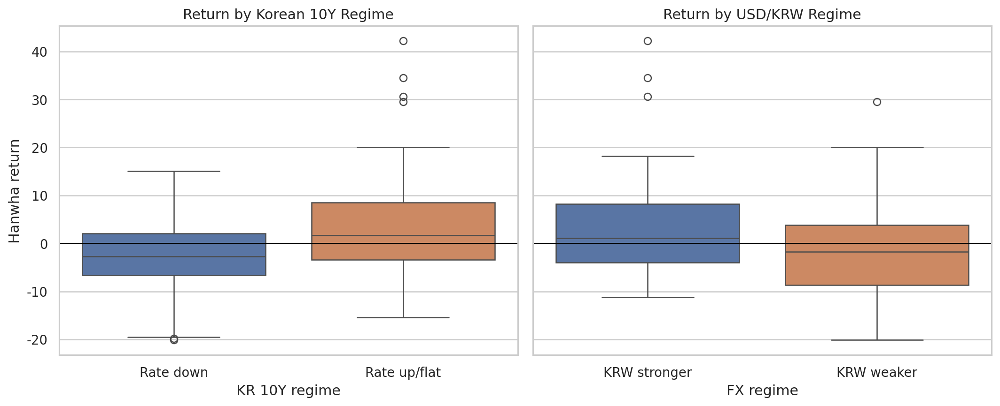
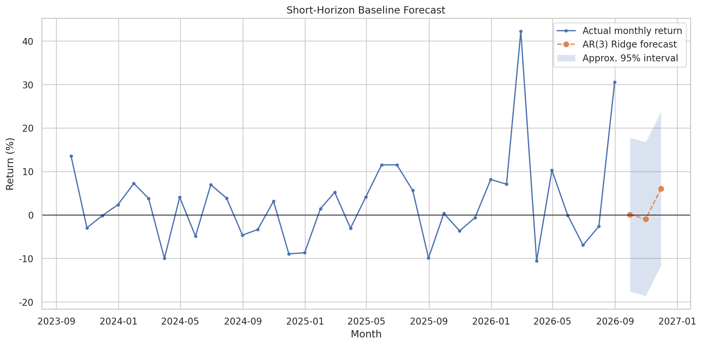
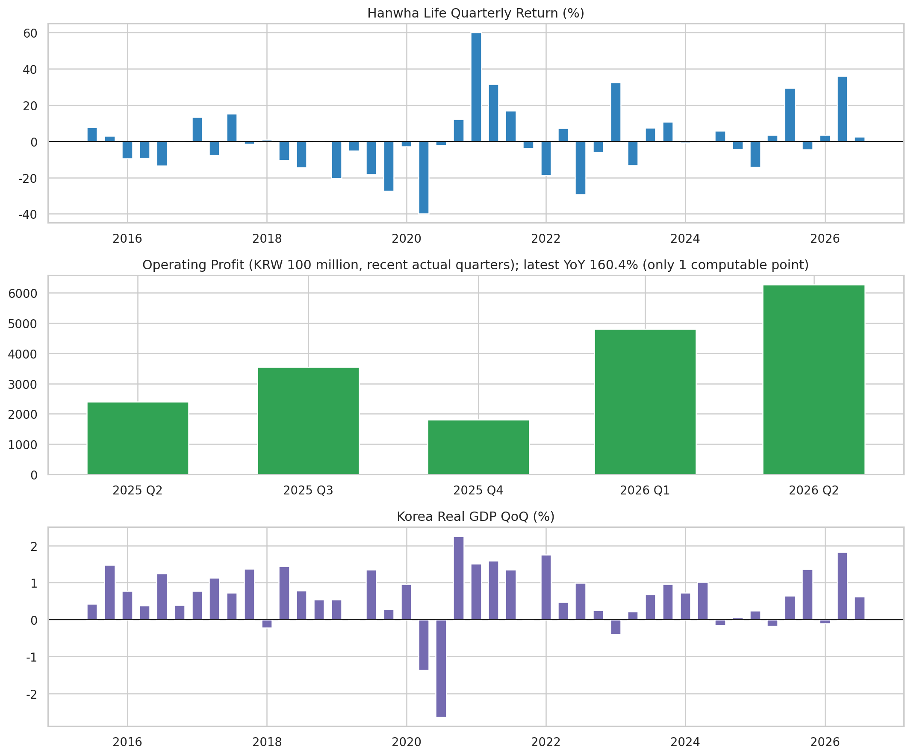

# 금리·환율·보험업 시장환경과 한화생명 주가의 관계

## 2015~2026년 월별 시계열 분석

**데이터 유형:** 실제 공개자료  
**분석 기간:** 2015-01-31 ~ 2026-08-31  
**핵심 완전관측치:** 140개(최소 100개 기준 충족)  
**주의:** 본 결과는 상관·탐색 분석이며 인과관계나 투자수익을 보장하지 않는다.

## 1. 분석 주제와 질문

1. 한화생명 월간 수익률은 KODEX 보험 ETF(140700) 월간 수익률(보험업지수 대용)과 같은 방향으로 움직이는가?
2. KOSPI 전체 시장을 통제하기 전의 단순 동행성은 어느 정도인가?
3. 한국 10년물 금리 변화와 원/달러 환율 변화가 한화생명 수익률과 어떤 관계를 보이는가?
4. 미국 10년물 금리 변화는 선택변수로서 추가 설명력을 암시하는가?
5. 관계가 전 기간에 안정적인가, 아니면 12개월 구간별로 달라지는가?
6. 보조적으로 한화생명 영업이익 증가율과 한국 GDP 성장률이 분기 주가수익률과 동행하는가?

## 2. 데이터 설명과 월별 집계 이유

- 한화생명(088350)·KOSPI: 각 달의 마지막 거래일 종가를 사용했다.
- KODEX 보험 ETF(140700): KRX 보험지수를 추종하는 공식 상품의 각 달 마지막 거래일 종가를 보험업 시장 대용변수로 사용했다. ETF 보수·분배금·추적오차 때문에 원지수와 동일하지 않다.
- 한국·미국 10년물 및 원/달러: 일별 흔들림과 국가별 휴장일 차이를 줄이기 위해 월평균을 사용했다.
- 주가·지수·환율: 단위가 서로 다르므로 월간 변화율(%)로 바꿨다.
- 금리: 이미 % 수준이므로 비율변화가 아니라 전월 대비 차이(%p)를 사용했다.
- 월 단위를 택한 이유: 일별 잡음을 줄이고, 2015년 이후 100개 이상 관측치를 유지하면서 분기 실적보다 빠른 시장 반응을 살피기 위해서다.

## 3. 결측치·이상치 원칙

- 결측치는 값이 없는 달을 숫자로 꾸며내지 않기 위해 보간하지 않았다. 서로 다른 출처를 월말축으로 맞춘 뒤 핵심 변수 중 하나라도 없는 달만 제외했다.
- 첫 달의 수익률·차분은 이전 달이 없어서 계산할 수 없으므로 제외했다.
- 이상치는 중앙값 절대편차(MAD) 기준 robust z-score 절댓값 3.5 초과로 **표시만** 했다. 금융위기·코로나 같은 실제 충격일 수 있어 본 분석에서는 삭제하지 않았다.
- 이상치 제거 여부가 결론을 바꾸는지는 후속 민감도 분석 대상으로 남겼다.

이상치 표시 건수:

|                              |   표시 건수 |
|:-----------------------------|--------:|
| outlier_hanwha_return_pct    |       3 |
| outlier_insurance_return_pct |       0 |
| outlier_kospi_return_pct     |       7 |
| outlier_kr10y_change_pp      |       1 |
| outlier_usdkrw_change_pct    |       1 |
| outlier_us10y_change_pp      |       3 |

## 4. 분석 방법: 무엇을 보려는가

1. **월간 변화율/금리차:** 단위가 다른 수준값을 같은 변화 개념으로 비교한다.
2. **상관계수:** 같은 달에 두 변수가 함께 오르내리는 정도를 -1~1로 요약한다. 인과관계는 아니다.
3. **12개월 이동상관:** 관계가 시기별로 강해지거나 약해지는지 확인한다.
4. **상승·하락 구간 통계:** 금리·환율 방향에 따라 한화생명 평균수익률 분포가 달랐는지 비교한다.
5. **추세 대용치와 잔차:** 12개월 중심 이동평균을 완만한 추세 대용치로 두고, 실제 로그주가와의 차이를 단기 변동(잔차)으로 본다. 잔차가 순수한 통계적 노이즈라는 뜻은 아니다.
6. **간단 예측(B 보너스):** 과거 3개월 수익률만 쓰는 AR(3) Ridge를 시간순서로 검증하고 과거평균 베이스라인과 MAE를 비교한다.

## 5. 분석 결과 및 시각화

### 전 기간 상관계수

|                      |   한화생명과의 상관계수 |
|:---------------------|--------------:|
| insurance_return_pct |         0.748 |
| kospi_return_pct     |         0.481 |
| kr10y_change_pp      |         0.077 |
| usdkrw_change_pct    |        -0.325 |
| us10y_change_pp      |         0.092 |

### 보조 분기 분석

분기 영업이익은 2023년 IFRS 17 도입 전후의 회계기준 변화 영향을 받을 수 있으므로 월별 핵심모형과 분리했다. GDP는 계절조정 실질 GDP 수준에서 전기 대비 성장률을 계산했다. 자동 수집된 영업이익 실제값은 최근 5개 분기이고 전년동기 증가율은 1개만 계산되어, 영업이익 상관계수는 표본 부족으로 제시하지 않는다.

|                             |   hanwha_quarterly_return_pct |   gdp_qoq_pct |   gdp_yoy_pct |
|:----------------------------|------------------------------:|--------------:|--------------:|
| hanwha_quarterly_return_pct |                         1     |         0.249 |        -0.17  |
| gdp_qoq_pct                 |                         0.249 |         1     |         0.435 |
| gdp_yoy_pct                 |                        -0.17  |         0.435 |         1     |

## 6. 근거가 있는 인사이트

### 인사이트 1 - Fact → Why → Action

- **관찰(Fact):** 절댓값 기준 가장 큰 동행 변수는 **KODEX 보험 ETF(140700) 월간 수익률(보험업지수 대용)**이며 상관계수는 **0.748**이다.
- **가능한 원인(Why·가설):** 한화생명도 보험업 공통의 금리·자본규제·투자자 심리 영향을 받기 때문일 수 있다. 그러나 공통 시장충격 때문에 함께 움직였을 가능성도 있다.
- **행동(Action):** 같은 달 상관만으로 매매 결론을 내리지 말고, KOSPI 통제 회귀와 시차변수·회사 고유 공시 이벤트를 추가해 가설을 검증한다.

### 인사이트 2 - 한국 10년물 방향별 차이

- **관찰:** 한국 10년물 금리가 상승·보합한 달의 한화생명 평균수익률은 **3.24%**, 하락한 달은 **-2.99%**였다.
- **해석 가설:** 금리 변화는 운용수익 기대와 채권평가손익·부채할인율을 동시에 움직이므로 방향 하나만으로 보험사 가치가 결정되지 않는다.
- **행동:** 금리 수준, 장단기금리차, IFRS 17 이후 CSM·K-ICS 지표를 함께 붙여 재검증한다.

### 인사이트 3 - 환율 국면별 차이

- **관찰:** 원/달러가 상승(원화 약세)한 달의 평균수익률은 **-1.93%**, 하락한 달은 **3.15%**였다.
- **해석 가설:** 해외자산 환산효과와 위험회피 심리가 서로 반대 방향으로 작용할 수 있다.
- **행동:** 해외투자자산 비중·환헤지 비율·외국인 수급을 추가해 환율 경로를 나눈다.

### 인사이트 4 - 관계의 시간가변성

- **관찰:** 가장 강한 변수와의 12개월 이동상관 범위는 **0.326~0.937**였다.
- **해석:** 전 기간 평균 상관 하나가 모든 시기에 그대로 적용되지 않는다.
- **행동:** 2020년 충격, 2022년 금리상승, 2023년 IFRS 17 도입 전후로 구간을 나눠 민감도를 비교한다.

## 7. 반례와 민감도

- 보험업 시장 계열이 오른 달인데 한화생명 수익률이 음수였던 비율은 전체 월의 **15.7%**다. 즉 업종 동행성이 있어도 회사 고유 요인 때문에 반대로 움직이는 반례가 존재한다.
- 월말 종가 대신 월평균 가격을 쓰거나, 동월이 아니라 1개월 시차를 주면 상관계수가 달라질 수 있다.
- 이상치를 제거하면 코로나·급격한 금리전환기의 정보가 사라질 수 있으므로, 원자료 유지 결과와 이상치 제외 결과를 나란히 비교하는 것이 바람직하다.

## 8. 보너스 B - 간단 예측 결과

- 검증구간: 최근 12개월
- AR(3) Ridge MAE: **11.55%p**
- 과거평균 베이스라인 MAE: **10.29%p**
- 검증 판단: **AR(3) Ridge의 MAE가 과거평균보다 1.27%p 높아 기준선을 개선하지 못했다.** 따라서 예측값보다 기준선 비교와 한계 설명이 더 중요하다.
- 가정: 과거 3개월 수익률과 오차 분산의 관계가 짧은 미래에도 크게 변하지 않는다.
- 한계: 주가수익률은 잡음이 크고 구조변화·공시·정책충격을 모형이 모른다. 예측구간은 근사치이며 투자판단에 사용하지 않는다.

## 9. 결론과 한계

이 분석은 한화생명 수익률이 보험업·시장·금리·환율과 함께 움직인 정도와 그 관계의 시간변화를 보여준다. 가장 중요한 결론은 상관이 인과가 아니며, 전 기간 평균만으로 개별 시기를 설명할 수 없다는 점이다.

한계는 다음과 같다.

- 배당을 완전히 반영한 총수익률 여부를 제공처별로 다시 확인해야 한다.
- 보험업 ETF 대용변수를 쓴 경우 보수·분배금·추적오차로 KRX 보험업 원지수와 차이가 날 수 있다.
- 2026년은 완결된 연도가 아니며 마지막 완료 월까지만 사용했다.
- IFRS 17 도입으로 2023년 전후 영업이익 비교 가능성이 낮아질 수 있다.
- 회사 고유 변수(CSM, K-ICS, 신계약가치, 지급여력, 배당, 자사주)와 규제·공시 이벤트를 포함하지 않았다.
- 다음 단계에서는 외국인 수급, 장단기금리차, 보험부채 듀레이션, 공시 이벤트 더미를 수집하고 시차회귀·구간별 회귀로 검증한다.

## 10. AI 사용 로그와 검증

| 사용 작업 | 사용 이유 | 사람이 확인할 검증 방법 |
|---|---|---|
| 변수 정의·분석 질문·코드 구조 초안 | 빠르게 대안을 비교하고 누락을 줄이기 위해 | PDF 요구사항 17문항과 함수·산출물을 일대일 대조 |
| 수집·정제·그래프·예측 코드 작성 보조 | 반복 코드를 줄이기 위해 | sample 모드 전체 실행, 행 수·날짜·단위 assert, 원자료 첫/끝 5행 대조 |
| 인사이트 문장 초안 | 관찰·가설·행동을 분리하기 위해 | REPORT 숫자를 processed CSV로 재계산하고, 인과 표현을 상관 표현으로 교정 |

AI 없이 핵심 결론을 재구성하려면 `data/raw` → `data/processed/monthly_analysis.csv` → `outputs/metrics.json` → 그래프 순서로 확인한다. 상관계수는 pandas `corr()`, 수익률은 `pct_change()*100`, 금리변화는 `diff()`로 직접 재계산할 수 있다.

## 11. 데이터 출처·수집 경고

- KRX 장기지수 호출에 계정 인증이 필요한 환경이라, 삼성자산운용이 KRX 보험지수 추종 상품으로 명시한 KODEX 보험 ETF(140700)를 보험업 시장 대용변수로 사용했습니다. ETF 보수·분배금·추적오차 때문에 원지수와 완전히 같지는 않습니다.
- 영업이익은 네이버 분기 연결 재무제표 스냅샷을 사용했습니다. 제출 전 한화생명 IR/공시 원문과 표본 대조가 필요합니다.

상세 출처·라이선스·직접 링크는 [DATA_SOURCES.md](DATA_SOURCES.md)에 정리했다.

## 12. 17개 평가문항 대응표

|   번호 | 평가문항                                                 | 대응 근거                                                            |
|-----:|:-----------------------------------------------------|:-----------------------------------------------------------------|
|    1 | 시계열 데이터가 100개 이상의 데이터 포인트를 포함하는가?                    | 월별 완전관측치 140개                                                    |
|    2 | 분석 질문이 3개 이상 명확하게 정의되어 있는가?                          | 아래 분석 질문 6개                                                      |
|    3 | 시계열 분석 기법 2가지 이상 결과가 리포트에 포함되어 있는가?                  | 변화율·12개월 이동통계·구간통계·상관                                            |
|    4 | 시각화가 필수 2개 이상 포함되어 있는가?                              | 총 7개                                                             |
|    5 | 권장 시각화 1개를 추가해 총 3개 이상을 구성했는가?                       | 총 3개 이상 및 예측 그래프 포함                                              |
|    6 | 인사이트가 3개 이상이며 각 인사이트에 관찰 근거가 포함되어 있는가?               | 인사이트 1~4의 수치 근거                                                  |
|    7 | GitHub 저장소에 코드·리포트·실행/데이터 출처 정보가 제공되는가?              | analysis.py, dashboard.py, REPORT.md, README.md, DATA_SOURCES.md |
|    8 | 데이터 로딩·정제·분석·시각화 흐름을 단계적으로 설명할 수 있는가?                | README의 실행 흐름 및 본 보고서 방법                                         |
|    9 | 결측치·이상치 처리 기준을 왜 그렇게 정했는지 설명할 수 있는가?                 | 결측/이상치 원칙 절                                                      |
|   10 | 시각화의 집계 단위와 그 선택 이유를 설명할 수 있는가?                      | 월별 집계 이유 절                                                       |
|   11 | 적용한 시계열 기법이 무엇을 보려는 것인지 설명할 수 있는가?                   | 분석 방법 절                                                          |
|   12 | 트렌드·계절성·노이즈 중 최소 1개를 그래프에서 어떻게 구분했는지 설명할 수 있는가?      | 그림 4의 이동평균 추세와 잔차                                                |
|   13 | AI가 만든 코드·해석을 어떤 방식으로 검증했는지 설명할 수 있는가?               | AI 사용 로그와 검증 절                                                   |
|   14 | 인사이트 1개를 관찰(Fact)→원인(Why)→행동(Action) 흐름으로 설명할 수 있는가? | 인사이트 1                                                           |
|   15 | 분석 결과가 달라질 수 있는 반례를 1개 이상 제시할 수 있는가?                 | 반례·민감도 절                                                         |
|   16 | 분석 한계와 다음 단계에서 추가 수집·검증할 데이터를 제안할 수 있는가?             | 결론과 한계 절                                                         |
|   17 | AI 사용 로그의 이유·검증 방법을 근거로 AI 없이도 핵심 결론을 재구성할 수 있는가?    | 데이터·수식·검증 파일 및 AI 사용 로그                                          |

## 13. 제출 링크

- GitHub 저장소 URL: `<업로드 후 실제 주소 입력>`
- 공개 웹 대시보드 URL: `<Streamlit 배포 후 실제 주소 입력>`

두 주소는 로그아웃 또는 시크릿 브라우저에서도 열리는지 확인한다. 이 절은 `analysis.py`를 다시
실행하면 기본 문구로 덮어써지므로, **최종 실자료 분석을 끝낸 다음 마지막에 주소를 입력한다.**
